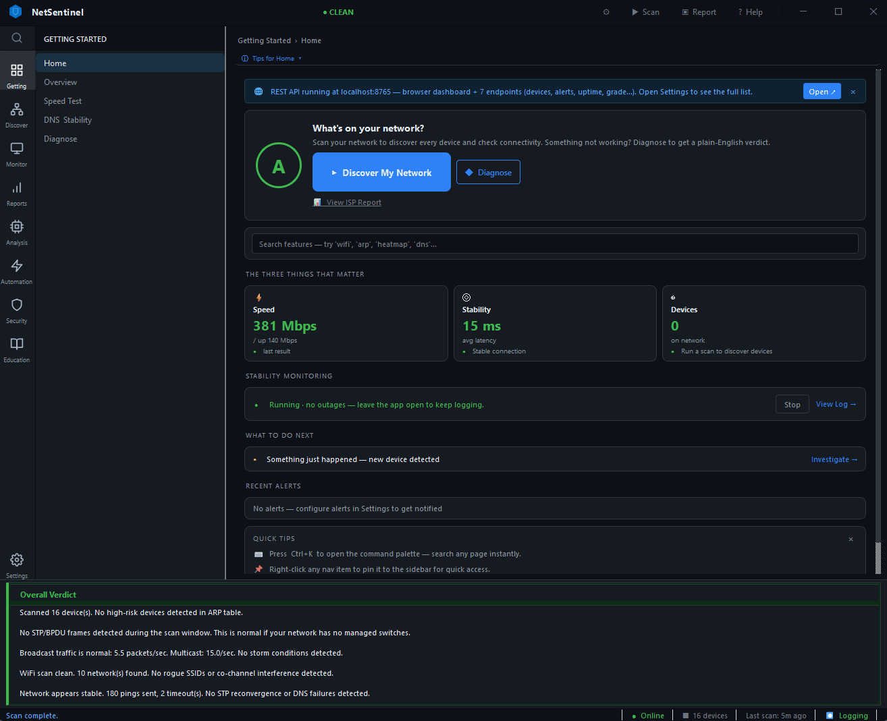
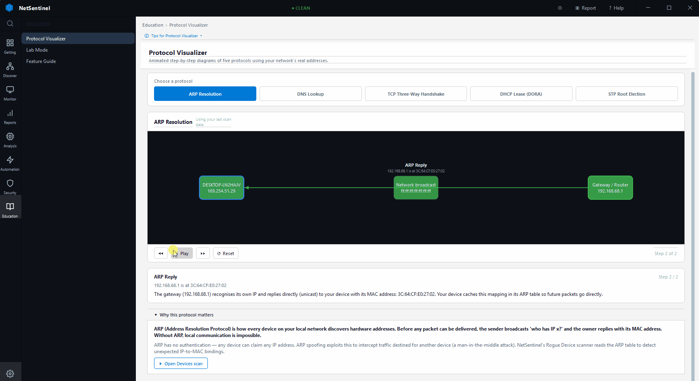

[](https://github.com/ossianericson/netsentinel/releases/latest)
[](LICENSE)
[](#install)
[](https://winstall.app/apps/NetSentinel.NetSentinel)
[](https://python.org)
[](tests/)

# NetSentinel

The free, open-source network monitor that works with **any** router, modem, or access point — not just the brands it was built for. Runs 100% locally.

<p align="center">
  
</p>

---

## Install

**Windows** — prefer winget (keeps the app updated automatically):

```powershell
winget install NetSentinel.NetSentinel
```

**macOS / Linux / manual Windows** — download the binary for your platform from the [latest release](https://github.com/ossianericson/netsentinel/releases/latest).

### Windows notes

Layer 2 features (STP, broadcast storm, ARP monitor) require [Npcap](https://npcap.com) — free, one-click installer maintained by the Nmap project. Standard features work without it.

If Windows blocks the installer on first run, right-click the downloaded file → **Properties** → check **Unblock** → **OK**, then run it. This does not apply to winget installs.

### macOS notes

> **Note:** Most features work on macOS. Gatekeeper bypass is required on first launch — right-click the app → **Open**.

Layer 2 features (STP, storm detection, ARP monitor) require libpcap:

```bash
brew install libpcap
```

Run with `sudo` to enable packet capture features. On Apple Silicon, ensure you are using a native arm64 Python build — x86_64 Python via Rosetta may have issues with Scapy and libpcap.

To run from source instead of the pre-built binary:

```bash
git clone https://github.com/ossianericson/netsentinel
cd netsentinel
pip install -r requirements.txt
sudo python app.py
```

### Linux notes

> **Note:** Tested on Ubuntu 22.04+ and Debian 12+.

Layer 2 features require libpcap:

```bash
sudo apt-get install libpcap-dev   # Debian/Ubuntu
sudo dnf install libpcap-devel     # Fedora/RHEL
```

If the app fails on launch with a Qt platform plugin error:

```bash
sudo apt-get install libxcb-cursor0
QT_QPA_PLATFORM=xcb sudo ./NetSentinel
```

To run from source instead of the pre-built binary:

```bash
git clone https://github.com/ossianericson/netsentinel
cd netsentinel
pip install -r requirements.txt
sudo python app.py
```

---

## Why NetSentinel exists

Most home network problems require a different tool for each symptom — a CLI ping tool, a separate ARP scanner, a Wi-Fi analyzer, a traceroute utility, and whatever your ISP recommends this week. None of them produce evidence you can hand to a support technician. None of them talk to each other.

The specific incident that started this project: a Google Nest speaker connected via Ethernet was winning the STP root bridge election on the local network. Every 30–45 seconds it forced the actual router to block its own uplink port and reconverge — producing exactly the intermittent drops and DNS failures that ISP helpdesks dismiss as "Wi-Fi interference." Tracking it down required jumping between five separate tools and produced no shareable evidence.

NetSentinel handles discovery, Layer 2 detection, long-term logging, and report generation in one place. No account, no cloud, no telemetry. Free forever.

**Replaces:**
- Nmap — device discovery, port scanning, OS fingerprinting
- Wireshark — broadcast storm detection and ARP monitoring (simplified, read-only)
- PingPlotter / MTR — hop-by-hop trace, stability logging, outage evidence
- Wi-Fi analyzer apps — hidden SSIDs, rogue APs, co-channel interference, signal heatmap
- Manual ISP support documentation — the ISP Accountability Report replaces the copy-paste grind

All analysis runs 100% locally. Nothing leaves your machine unless you explicitly trigger an external check.

---

## Works with any hardware — open plugin protocol

Most network monitoring tools are locked to their own ecosystem. Ubiquiti works with UniFi. Synology works with Synology. If your hardware is not on the supported list, you are out of luck.

NetSentinel takes a different approach: **an open plugin protocol that any Python script can implement.**

The full interface is four functions and two variables:

```python
HARDWARE_NAME = "My Router XYZ"   # displayed in the app
HARDWARE_TYPE = "router"           # router | modem | ap | switch | other

def get_info()    -> dict   # static metadata: model, firmware, IP
def get_status()  -> dict   # live data: WAN IP, uptime, signal, speed
def get_clients() -> list   # connected devices: ip, mac, hostname (optional)
```

That is the entire contract. Any `.py` file that satisfies it becomes a first-class NetSentinel integration.

### How users create integrations

The **Integrate Hardware** page (Extend section in the nav) walks through the process in four steps:

1. **Find your hardware's API** — GitHub search strings, Home Assistant integration library, and a five-step browser dev-tools workflow (F12 → Network tab → Copy as cURL) to capture the exact API calls your router admin panel makes
2. **Write the script** — a ready-to-run Python template you fill in, or hand to an AI
3. **Test and import** — NetSentinel validates the plugin via AST (no code executed during validation), then runs it in a sandboxed subprocess so a buggy script cannot crash the app; output appears inline
4. **Share** — submit a working script as a GitHub Issue; reviewed and merged as a built-in integration for all users

### The AI angle

An AI assistant (Claude, ChatGPT, Gemini) can write a working plugin for most hardware in about 10 minutes if you give it the right input. The page includes three copy-ready AI prompts:

- **Prompt A** — general: "write a script for my Brand Model at 192.168.1.1, I need WAN IP, uptime, clients, and speed"
- **Prompt B** — from cURL: paste the captured request from your browser dev tools and ask the AI to convert it to a full plugin (this produces the best results)
- **Prompt C** — debug: paste a broken script and error message and ask the AI to fix it

### Current status and roadmap

| Capability | Status |
|---|---|
| Plugin import with AST validation | ✅ Live in v1.9.8 |
| Sandboxed subprocess test with inline output | ✅ Live in v1.9.8 |
| In-app guidance, template, and AI prompts | ✅ Live in v1.9.8 |
| Plugin clients → Devices table (with source badge) | 🔜 Next milestone |
| Plugin status → Overview hardware tile | 🔜 Next milestone |
| Plugin device names → Topology diagram | 🔜 Next milestone |
| Community plugin library (built-in integrations) | 🔜 Depends on submissions |

The test-and-validate workflow is live now. Data flowing from a plugin into the rest of the app is the next development sprint.

### Validation approach

The two reference integrations built into NetSentinel (TP-Link Deco mesh, ZTE MC889 5G modem) are being rebuilt using only the in-app plugin guide and an AI assistant — no internal documentation. If the workflow produces working scripts for those devices, it works for anything. Results and scripts will be published as the first entries in the community plugin library.

---

## Quick start

1. Install NetSentinel — see [Install](#install) above
2. On Windows, install [Npcap](https://npcap.com) if you want STP, broadcast storm, or ARP monitor features
3. Run as Administrator — right-click the app → **Run as Administrator** on Windows; `sudo python app.py` on macOS/Linux
4. Click **Scan** in the top bar to discover all devices on your network
5. Open the **Network Grade** tab for an A–F assessment across 8 health dimensions

---

## Features

### Works without admin rights

| Feature | What it tells you |
|---|---|
| Device discovery | Every device's IP, MAC, hostname, vendor, and model (e.g. "Google Nest Audio", "TP-Link Deco M5") with device type and risk level |
| Network grade A–F | Benchmark across uptime, latency, jitter, DNS speed, download speed, device safety, STP health, and storm level vs. a "perfect home network" baseline |
| ISP Accountability Report | MTR hop table, packet-loss %, DNS latency, and timestamped outage log formatted as a standalone HTML file for support escalation |
| Stability logger | Runs unattended for hours or days — timestamped CSV log of every ping, DNS latency, and ARP change; evidence-grade output for ISP disputes |
| Availability history | Persistent RTT and UP/DEGRADED/DOWN state charts per device with 1 h / 12 h / 24 h / 7 d zoom |
| DNS benchmarking | Compares your system resolver against Cloudflare, Google, and Quad9 side-by-side; includes DNS leak test |
| Speed test | 3-tier engine: Ookla CLI → speedtest-cli → pure-Python fallback with no extra dependencies |
| TLS certificate monitor | Hourly expiry checks per host; alerts 30 days before expiry; OK / EXPIRING / EXPIRED badges |
| Active connections | Process-to-socket map with one-click firewall block/unblock per process |
| Live bandwidth chart | 60-second rolling upload/download chart per interface |
| CVE lookup | Cross-references discovered OS and service versions against the NVD database on demand |
| Wi-Fi network scan | Hidden SSIDs, rogue APs, WPS-enabled networks, co-channel interference, connected client list |
| IoT behaviour baseline | Learns normal traffic per IoT device; alerts on port scans, new destinations, and traffic rate spikes |
| DHCP lease inventory | Lists all active DHCP leases; flags any rogue DHCP server on the segment |
| Geolocation map | Plots internet-facing IPs on an offline world map using MaxMind GeoLite2-City — no API key, no external calls |
| Topology diagram | Visual topology diagram: flat star by default; upgrades to a three-tier mesh tree (Gateway → Satellites → Clients grouped by satellite) when Deco credentials are configured — devices invisible to the mesh attach directly to the gateway so nothing is dropped |
| Mesh router integration | Pulls live data from your mesh gateway — Deco-assigned device names replace rDNS guesses in the Devices on Network table; Node and Band columns appear automatically; per-device upload/download rates from the router's own counters. Runs silently after each scan when credentials are saved. TP-Link Deco fully supported; architecture supports Eero, Google Nest, Asus ZenWiFi, Netgear Orbi |
| **Hardware plugin protocol** | **Import any router, modem, or AP via a 4-function Python script. In-app guide covers finding the API, writing the script with AI assistance, testing in a sandboxed subprocess, and submitting to the community library. Plugin data flowing into Devices and Overview is the next milestone — see [Works with any hardware](#works-with-any-hardware--open-plugin-protocol) above.** |
| Automation hooks | Webhook and script triggers on network events — device down, high RTT, new device discovered |
| REST API | Read-only local HTTP API at `http://127.0.0.1:8765` — query devices, alerts, and uptime from Home Assistant or scripts |
| "What's Wrong?" diagnosis | One-click root-cause analysis across slow / dropping / can't-connect symptoms — sequences network, storm, rogue device, and STP checks then surfaces a prioritised plain-English finding |
| Shareable diagnostic card | "Share Card" button on the Overview page — exports a 520×300 summary card (grade, ISP, top 3 findings) as PNG, clipboard image, or standalone HTML; zero external dependencies |
| Lab / Scenario Mode | Four guided exercises — Find the Rogue Device, Diagnose Slow DNS, Identify the Broadcast Storm Source, Map Your Subnet — with progressive hints, solution reveal, and exportable HTML result report |

### Requires admin + Npcap (Windows) / libpcap (macOS, Linux)

| Feature | What it tells you |
|---|---|
| STP root bridge detection | Identifies which device is claiming the root bridge via BPDU capture — the hidden cause of periodic 30–45 s reconnection drops |
| Broadcast storm detection | Measures broadcast and multicast flood levels that silently choke bandwidth; pinpoints the source device |
| ARP spoofing detection | Watches for MAC address conflicts that indicate a MITM attack in progress on the local segment |
| Per-device bandwidth monitor | Exact rx/tx bps per device via live packet capture |
| SYN stealth port scanner | Half-open TCP scan — faster and quieter than a connect scan; requires Scapy + admin |
| Full device discovery | Parallel ARP + ICMP + TCP SYN + mDNS sweep for maximum device census accuracy |

---

## For educators and students

NetSentinel runs real scans against a live network, which means every result maps directly to a protocol or concept covered in CompTIA Network+ and CCNA curricula.

**Concepts visible in real time:**
- **ARP** — the ARP Spoof Watch tab shows every ARP request and reply on the segment; the device table shows the current MAC-to-IP mapping your system holds
- **DNS** — the DNS & Outages tab graphs resolver latency live; the DNS benchmarking tool compares four resolvers simultaneously; the DNS leak test shows exactly which resolver handles your queries
- **STP** — the Rogue Bridge tab captures BPDUs and identifies the current root bridge, port roles, and reconvergence timing
- **TCP** — the port scanner and Active Connections tab show three-way handshake outcomes (open/filtered/closed) and live socket states per process
- **DHCP** — the DHCP Lease Inventory tab parses the OS lease table and flags any unauthorized DHCP server on the segment
- **ICMP** — the Stability Logger and Availability History tabs plot round-trip times and packet loss across days or weeks
- **Layer 2 vs. Layer 3** — STP, ARP, and broadcast storm features operate at Layer 2 (MAC/frame); device discovery, DNS, and traceroute operate at Layer 3 (IP); each tab makes the distinction explicit

**Built-in reference material:**
- **Protocol Visualizer** — animated step-by-step diagrams of ARP resolution, DNS lookup, TCP handshake, DHCP lease, and STP election using real scan data from your own network (not placeholder addresses)

<p align="center">
  
</p>

- **Lab / Scenario Mode** — four guided exercises (Find the Rogue Device, Diagnose Slow DNS, Identify the Broadcast Storm Source, Map Your Subnet) with progressive hints, solution reveal, and exportable HTML result reports
- IP and subnet calculator with reference panels explaining CIDR notation, subnetting rules, and address classes
- 24-term networking glossary (ARP, BPDU, CGNAT, CVE, mDNS, STP, TLS, and more) — accessible via the help button from any page without leaving current context
- In-app "Common Scenarios" lookup table mapping 17 user goals to the correct feature

**On the roadmap for structured learning:**
- CompTIA Network+ / CCNA curriculum alignment tags on each feature page, plus an exportable study-session report
- Classroom export — signed scan reports with machine fingerprint for instructor aggregation and graded lab submissions

If you use NetSentinel in a course or lab and need curriculum-specific features, open an issue — feedback from educators shapes the roadmap directly.

---

## Quality

The project ships with **1 550+ automated tests** covering detection logic, metric storage, version consistency, and UI wiring. Run the full suite with:

```bash
python -m pytest tests/ -v --tb=short
```

All tests are offline — no real network traffic, no live devices required.

---

## Architecture

See [docs/architecture.md](docs/architecture.md) for module layout, data flow, and design decisions.

The short version: [app.py](app.py) is the GUI entry point; [cli.py](cli.py) is the headless CLI; all detection logic is in [modules/](modules/); UI pages are in [ui/pages/](ui/pages/); background threads are in [workers/](workers/). All colour and style values live in [ui/styles.py](ui/styles.py) — no hex values appear elsewhere in the UI code.

---

## Contributing

See [CONTRIBUTING.md](CONTRIBUTING.md) for the development setup, coding conventions, and PR process.

### Hardware plugins (no coding required beyond Python)

If you own a router, modem, or AP that is not yet supported, the highest-value contribution is a working plugin script. Use the **Integrate Hardware** page in the app — the four-step guide and AI prompts get most people to a working script in under 30 minutes.

To submit: open a GitHub Issue titled `[Hardware Plugin] Brand Model XYZ`, attach the `.py` file, describe what `get_status()` returns, and list any `pip install` dependencies. Reviewed scripts are merged as built-in integrations.

**Template for the issue:**

```
Hardware: Brand Model XYZ
Firmware tested: vX.Y.Z
Access method: HTTP REST / HTML scrape / SNMP / SSH
pip dependencies: requests, beautifulsoup4   (or none)
get_status() returns: wan_ip, uptime_sec, connected_clients, download_mbps, upload_mbps

[attach your .py file]
```

### Rogue device signatures (edit a JSON file, no Python needed)

To flag a device that misbehaves on home networks, edit [`offenders.json`](offenders.json) and submit a pull request:

```json
{
  "vendor": "Your Device Brand",
  "ouis": ["aa:bb:cc"],
  "known_issues": ["STP BPDU injection — claims Root Bridge via Ethernet"],
  "risk_level": "HIGH",
  "forum_reference": "https://...",
  "remediation": "Disconnect its Ethernet cable and use Wi-Fi backhaul only."
}
```

---

## Privacy

No telemetry. No cloud. No accounts. All scanning and analysis runs on your machine.

The only external endpoints contacted are ones you explicitly trigger:

| Endpoint | Purpose |
|---|---|
| `speed.cloudflare.com` | Download speed test |
| `services.nvd.nist.gov` | CVE lookup (Security Audit mode, on demand) |
| `bash.ws` | DNS leak test |
| `api.github.com` | Update check on startup |

All other analysis — device discovery, ARP monitoring, STP detection, bandwidth logging, availability tracking — is local.

---

## Changelog

### v1.9.57

**Fixed**
- `ui/topology_widget.py`: invalid escape sequence (`\ `) in module docstring replaced with raw string — eliminates `DeprecationWarning` in full test run

### v1.9.56

**Fixed**
- Test suite crash (`STATUS_STACK_BUFFER_OVERRUN`) at ~52% run: `QFileSystemWatcher` OS threads in `test_hardware_integration.py` were accumulating without cleanup; fix mocks the watcher and adds explicit `_tick_timer.stop()` + multi-pass `deleteLater()` cleanup
- Removed module-level `QApplication` creation from 7 test files (`test_hardware_integration`, `test_home_page`, `test_mesh_grouping_toggle`, `test_notifications_page`, `test_overview_page`, `test_settings_and_onboarding`, `test_themes`) — conftest.py's session fixture now owns the `QApplication`
- `test_hub_card_errors.py` rewrote widget creation to use factory fixtures with `deleteLater()` cleanup; removed module-scoped `qapp` fixture that duplicated conftest

**Added**
- `tests/test_codeql_prevention.py` — static AST checks for bare `except:` blocks (CodeQL `py/bare-except`) and URL substring comparisons in test files (CodeQL `py/incomplete-url-substring-sanitization`)
- `tests/conftest.py` QSettings isolation fixture (`isolated_settings`, autouse) — each test gets a unique org/app name so QSettings state cannot leak between tests
- `tests/conftest.py` crash logger fixture (`_crash_logger` / `_log_test_name`) — writes test names to `ns_test_crash_log.txt` before each run to identify last test before a process-level crash
- `RULE-WIN3` and `RULE-WIN4` in `CLAUDE.md` — document the Qt test lifecycle rules learned from the crash investigation

### v1.9.55

**Fixed**
- `data/plugin_hashes.json` hashes now computed on LF-normalised content via `_file_hash()` in `modules/plugin_tools.py` — `TestBundledPluginHashSync` was failing on Linux/macOS CI because hashes generated on Windows (CRLF) differed from checkout content (LF)
- `TestBundledPluginHashSync` and `TestVerifySignature.test_verified_when_hash_matches` updated to use `_file_hash()` for cross-platform consistency
- Documented the gap: `.apm/instructions/` are the true sources; `bump_version.py`'s `apm compile` step regenerates `.claude/rules/` from them — manual edits to `.claude/rules/` are overwritten
- Updated `RULE-21-I` in `.apm/instructions/development-rules.instructions.md` (canonical source): "tag" now means the exact four-step sequence: `bump_version.py` → push branch → tag → push tag

### v1.9.54

**Fixed**
- Resolved all open CodeQL alerts: `py/empty-except` comments added in `hardware_integration_page.py`, `dashboard.py`, `plugin_device_page.py`, `plugin_polling_worker.py`, `plugin_tools.py`, `nspkg.py`, `deco_plugin.py`, `zte_plugin.py`
- `py/unnecessary-pass` removed from `plugin_polling_worker.py` `SystemExit` handler
- `py/variable-redefined` fixed in `modules/nspkg.py` (dead `plugin_dest` assignment removed)
- `py/unused-global-variable` removed `_MANIFEST_VERSION` from `modules/nspkg.py`
- Removed `import os` (unused) from all 8 non-credential bundled plugins; regenerated `data/plugin_hashes.json`
- Removed unused imports from `hardware_integration_page.py`, `plugin_tools.py`, `plugin_polling_worker.py`, and all affected test files
- Updated `RULE-21-I`: "tag" now means exactly: `bump_version.py` → push branch → push tag, every time without exception

### v1.9.53

**Fixed**
- `data/plugin_hashes.json`: regenerated after P1-3 edited bundled plugins; stale hashes caused `_start_poll_worker_inst` to silently return early — no plugin produced data on startup
- `ui/pages/hardware_integration_page.py`: added explanatory comments to five bare `except: pass` blocks (CodeQL `py/empty-except` #740–#745)
- `tests/test_plugin_tools.py`: `TestBundledPluginHashSync` regression guard — fails immediately when any bundled plugin is edited without regenerating the hash database

### v1.9.52

**Added**
- `HubCard`: `✎` rename button on every hub card — click to set a new display name inline; nav item label, breadcrumb, pinned set, and command palette all update atomically (P3-4)
- `HardwareIntegrationPage`: `plugin_renamed` signal (path, old_label, new_label) emitted on confirmed rename
- `ui/dashboard.py` `_on_plugin_page_renamed`: handler propagates display-name change to `_nav_label_to_widget`, `_nav_page_to_section`, `_nav_sections["Extend"]` entries, and `_nav_pinned_labels` atomically (P3-4)
- `tests/test_credential_robustness.py` — 8 tests: `_instance_id` determinism and uniqueness; multi-instance independence; credential dialog IP pre-fill; rename registry update; stable key algorithm (P4-4)
- `tests/test_plugin_isolation.py` — 5 tests: module namespace isolation between poll cycles; independent namespaces for concurrent workers; concurrent poll guard (P5-3, P5-4)
- `tests/test_plugin_resilience.py` — 10 tests: backoff interval calculation; backoff reset after success; AUTH-exempt circuit breaker; FILE: error classification; instance-ID keying consistency (P6-1, P6-3, P6-5, P7-5)

### v1.9.50

**Fixed**
- `workers/plugin_polling_worker.py`: replaced `os.environ["NETSENTINEL_PLUGIN_IP"]` with direct module-attribute injection (`mod._NETSENTINEL_INSTANCE_IP`, `mod._NETSENTINEL_INSTANCE_ID`) after `exec_module` — each instance gets its own namespace, zero cross-instance IP pollution (RULE-PL1)
- `ui/pages/hardware_integration_page.py` `_PluginConnectionTester`: injects `_NETSENTINEL_INSTANCE_IP` into the module after `exec_module`; env-var shim kept with proper `finally` restore for backwards-compat
- `plugins/deco_plugin.py`, `plugins/zte_plugin.py`: `_load_credentials()` reads `globals().get("_NETSENTINEL_INSTANCE_IP")` first (correct idiom — `sys.modules[__name__]` fails for modules loaded via `module_from_spec`), then falls back to env var, then `HARDWARE_IP`
- `HubCard`: adds `🔑 Re-enter Password` button shown only on `AUTH:` errors; clicking reopens the credential dialog with current IP pre-filled and restarts the worker on success — no need to delete and re-add a plugin when a password changes (P4-1)
- Credential dialog: saves password to `NetSentinel/plugin/<instance_id>` (per-instance keyring, P4-2) in addition to the legacy `NetSentinel/hardware/<ip>` key; bundled plugins check the per-instance key first
- `ui/dashboard.py`: `_reload_section(name, force_open)` helper consolidates flyout-reload logic previously duplicated across `_on_plugin_page_added` and `_on_plugin_page_removed` (RULE-PL3)
- `ui/dashboard.py` `_on_plugin_page_added`: calls `_nav_rail_go_to(label)` after flyout reload so the new plugin's device page is shown immediately on add (P3-2)
- `workers/plugin_polling_worker.py`: file-missing error now emits `FILE: plugin file not found at <path>` prefix so `_classify_error` can route it to a "Re-import" action (P6-2 prefix)

**Added**
- `tests/test_env_var_isolation.py` — 6 tests: module attribute preferred over env var; env var restored on success and failure; concurrent `exec_module` loads have independent namespaces; worker leaves `os.environ` unchanged; FILE: prefix on missing plugin file

### v1.9.48

**Added**
- `modules/nspkg.py` — `.nspkg` plugin bundle format (ZIP with `plugin.py` + `manifest.json` + optional `icon.png`); `unpack_nspkg()` validates manifest and extracts to AppData/plugins (P3-5)
- Hardware Hub "⬡ Import .nspkg" button — imports a `.nspkg` bundle, verifies manifest, shows unsigned-plugin consent, then calls the normal registration flow
- P2-2 `CONFIG_SCHEMA` support — plugins declare typed config fields (`poll_interval`, `verify_ssl`, etc.); `HubCard` auto-generates a ⚙ config panel; values saved per-instance in QSettings and passed to `get_status(config=…)` on each poll
- Community plugin Browse tab (P3-4) — fetches a GitHub-hosted JSON index in a background thread; per-entry SHA-256 verified before download; Install button copies plugin to AppData/plugins and calls the normal registration flow
- `_CommunityIndexThread` / `_CommunityDownloadThread` — non-blocking background workers for P3-4
- `tests/test_nspkg.py` — 13 tests covering bundle unpacking, manifest validation, safe filename, icon extraction, and error paths
- `tests/test_community_index.py` — 9 tests covering index fetch, SHA-256 mismatch, non-list response, and download success

**Fixed**
- CodeQL `py/empty-except` #696 — `ui/dashboard.py` modem log write now has an explanatory comment

### v1.9.47

**Added**
- `modules/plugin_tools.py` — plugin validator CLI (`python -m modules.plugin_tools validate <plugin.py>`); static checks for required constants, function signatures, PYPI_PACKAGE, top-level network calls, and imports outside safe list (P3-1)
- `tools/generate_plugin_hashes.py` + `data/plugin_hashes.json` — build-time SHA-256 hash list for bundled plugins; runtime signature verification in `_start_poll_worker_inst` blocks tampered plugins (P4-2); `TestBundledPluginHashSync` CI guard prevents stale-hash silent failures
- Plugin instance rename — `✎` button on each Hub card renames the instance inline; change propagates atomically to nav flyout label, breadcrumb, pinned section, and command palette (P3-4)
- P4-3 restricted import advisory — `validate_plugin()` warns when imports fall outside `_DEFAULT_SAFE_IMPORTS`; plugin may declare `SAFE_IMPORTS = [...]` to acknowledge custom imports
- Hardware Hub "⬡ New Plugin" button — 6-field template wizard dialog generates a filled-in `.py` file in the user plugins dir, then offers to open it in the system editor (P3-2)
- Plugin icon support — `HubCard` and catalog cards display a 24×24 PNG icon when `icon.png` is found alongside the plugin file or `ICON_PATH` constant is declared (P2-3)
- `_validate_script` now extracts `icon_path` from sibling `icon.png`/`icon.jpg`/`icon.svg` and from `ICON_PATH` constant
- `tests/test_plugin_tools.py` — 23 tests covering validator, signature check, and CLI (RULE-T1)
- `tests/test_import_bundled.py` — 28 tests covering `_validate_script`, `_path_hash`, `_instance_id`, AppData copy logic, PYPI_PACKAGE check, and `_classify_error` (closes RULE-T1 gap)

### v1.9.46

**Added**
- `workers/plugin_polling_worker.py`: `log_line` signal emits structured per-poll log entries (`[HH:MM:SS] get_info() → …`, errors, result status)
- Hardware Hub `HubCard`: `≡ Logs` toggle button expands a collapsible 130 px console showing the last 100 plugin log lines; wired via `_start_poll_worker_inst`
- `_migrate_stale_paths()` extracted to module level so it is directly testable and callable without a widget instance
- `_is_consented()` / `_record_consent()`: sha256-based one-time consent store for non-bundled plugins (P4-1)
- P4-1 unsigned plugin warning dialog — shown once per unique plugin file before `_on_browse` registers a non-bundled script; consent persisted in QSettings
- `tests/test_plugin_validator.py` — 16 tests for `_validate_script` and `_classify_error` (RULE-T1)
- `tests/test_plugin_health.py` — 15 tests for health tracking, circuit-breaker, and path-hash helpers (RULE-T1)
- `tests/test_plugin_migration.py` — 6 tests for `_migrate_stale_paths` path-replacement logic (RULE-T1)
- `tests/test_hub_card_errors.py` — 13 tests for `HubCard.set_error` routing and `PluginDevicePage` banner pip-install detection (RULE-T1)

### v1.9.45

**Added**
- Home page unified "Getting Started" checklist — hardware setup (ZTE MC889, Deco XE75) and core setup steps (scan, grade, ARP) in one prominent card; "Add →" buttons open the credential dialog directly without navigating away; card hides after all 5 steps are ticked

**Changed**
- `modem_page.py`, `mesh_router_page.py`, `workers/zte_worker.py`, `workers/mesh_worker.py` removed; ZTE MC889 and TP-Link Deco XE75 are managed exclusively via the hardware plugin system
- `hardware_integration_page.py`: modem and mesh tabs removed; credential dialog wired into `_import_bundled` so password is requested on first add and stored in OS keychain

**Fixed**
- `home_page.py`: `_check_recurring_mode` was iterating dict keys (always truthy) instead of values when testing whether all setup steps are complete
- `first_run_dialog.py`: removed unused `QRect` import (CodeQL `py/unused-import` #694)

### v1.9.44

**Added**
- `ui/first_run_dialog.py`: 3-slide Apple-style welcome wizard (Welcome → Discover & Protect → Monitor) with progress dots, Back/Next navigation, and "Scan my network →" CTA on the final slide
- `PluginDevicePage` modem view: `SignalBar` widgets for RSRP and SINR in 5G NR and LTE sections, matching the visual quality of the dedicated Modem page

**Changed**
- Extend nav section: "Modem" and "Mesh & Router" legacy items removed; hardware plugin pages (e.g. ZTE MC889, TP-Link Deco XE75) are the sole nav entries under Extend
- Home page hardware setup cards now navigate to Hardware page instead of legacy Modem/Mesh pages
- Startup window geometry: fresh installs open at 1280×800 centered on the primary screen instead of a random position
- `mesh_router_page.py`: `_on_scan_clicked`, `_on_forget_clicked`, and `_on_result` now fall back to placeholder IP when the field is empty (matching modem page behaviour)

**Fixed**
- `ModemPage` and `MeshRouterPage` incorrectly auto-filling the gateway IP instead of showing a blank field on first launch
- Extend section nav items for Modem/Mesh appearing even when no device was configured
- Home page "Set up →" links for 5G Modem and Mesh Router silently failing when legacy nav items were not registered

### v1.9.43

**Added**
- `tests/test_hardware_integration.py` — 35 tests covering `HardwareIntegrationPage` crash scenarios (startup, delete-while-timer-pending, password save/forget, plugin import lifecycle)
- Hardware plugin dependency auto-install: `PYPI_PACKAGE` constant added to 6 bundled plugins (asus, fritzbox, mikrotik, netgear, openwrt, unifi); clicking "＋ Add" now opens `PipInstallDialog` automatically if the library is missing
- `HubCard` inline install button: missing-dependency errors now show a blue "⬇ Install X" button instead of raw "run: pip install X" text; clicking installs the library and re-polls immediately

**Fixed**
- `hardware_integration_page.py`: `RecursionError` crash — `on_native_modem_data` was emitting `plugin_result`, creating an infinite signal loop via `_on_hardware_plugin_result` → `_on_modem_signal` → `on_native_modem_data`
- `hardware_integration_page.py`: `AttributeError: 'NoneType' has no attribute 'upper'` in `on_modem_card_data` when `network_type` key is present but `None`
- `hardware_integration_page.py`: startup crash `AttributeError: 'str' object has no attribute 'get'` in `_display_name` when QSettings data is corrupt or a plain string
- `hardware_integration_page.py`: `RuntimeError: wrapped C/C++ object deleted` when a `HubCard` was removed while its 3-second refresh `QTimer` was still pending
- Bundled ZTE/Deco plugin password not propagating to the card after a QSettings wipe; cards now auto-import bundled plugins on first launch
- Qt stylesheet parse warnings reduced across `modem_page.py`, `mesh_router_page.py`, `plugin_device_page.py`, and `hardware_integration_page.py`

### v1.9.42

- **wmic → CimInstance migration** — all credentialed-scan Windows commands ported from deprecated `wmic` to `powershell -NoProfile Get-CimInstance`; fully compatible with Windows 11 24H2 where wmic is removed
- **REST API hardening** — CORS restricted to `localhost` origins only; query-parameter auth removed (header-only `X-API-Key`); switched from Flask dev server to waitress WSGI for production-grade serving
- **CLI output path validation** — `cli.py` now resolves output paths with `Path.resolve()` and creates missing parent directories; exits cleanly with a user-readable error if the path is invalid
- **GeoLite2-City onboarding hint** — first-run wizard gains a geo-map info banner explaining the MaxMind DB download step
- **MSIX cosign signing in CI** — release workflow signs the MSIX artifact with `cosign sign-blob` (keyless OIDC) and uploads the `.bundle` file to the release; verification command included in release notes
- **HTML coverage reports in CI** — pytest runs produce `htmlcov/` which is uploaded as a per-platform artifact (`coverage-windows`, `coverage-macos`, `coverage-linux`)
- **FORCE_JAVASCRIPT_ACTIONS_TO_NODE24 removed** — env var dropped from all 5 CI jobs now that the runner default is Node 24

### v1.9.41

- **Notification channel test buttons** (SET-1) — Settings > Active Integrations now shows a "Send test" button next to Email, Webhook, and Pushover rows; each fires a live test message off the main thread and shows a toast with the result
- **Accent colour picker** (SET-2) — Settings > Appearance gains a row of 6 preset accent swatches and a "Custom…" colour dialog; the override is saved to QSettings `ui/accent_override` and applied to `ACCENT`, `ACCENT_LITE`, `ACCENT_DARK` at next launch
- **Settings export / import** (SET-3) — Settings > Maintenance gains "Export settings (JSON)" and "Import settings" buttons backed by the new `modules/settings_io.py`; secrets remain in the OS keychain and are never written to the export file
- **Signal strength bar widget** (POLISH-12) — new `ui/widgets/signal_bar.py` QPainter widget draws 5 phone-style vertical bars for RSRP, RSRQ, SINR, SNR; wired into Modem page signal cards (5G NR and LTE sections)
- **Reports chart preview** (POLISH-14) — Reports page shows a matplotlib sparkline of device count and network grade for the last 7 days above the schedule config
- **Geo Map risk heatmap** (VIZ-8) — a "Show risk heatmap" toggle draws radial colour glow behind Threat Intel (red) and Exposed Service (amber) dots to highlight geographic risk concentrations
- **Keyboard shortcut hints in tooltips** (EDU-2) — Settings button tooltip shows `Ctrl+,`, sidebar search shows `Ctrl+F`, Monitor section rail button shows `Ctrl+L → Network Logger`, scan button tooltip lists Ctrl+K and Ctrl+F hints

### v1.9.40

- **Geo map enriched detail panel** (VIZ-1) — clicking a mapped IP now shows a full enriched panel: flag + country/city, ASN/org, threat-intel risk chip, up to three TI indicator rows, alert count from the last 24 h, and a "View in Threat Intel →" button that navigates directly to the Threat Intel page
- **Bandwidth event annotations** (VIZ-2) — rate-spike and new-device events are now annotated directly on the Live Bandwidth chart with a dashed vertical line and a rotated label; annotations age across the 60-second rolling window
- **Protocol visualizer name overlay** (VIZ-7) — AnimNodes whose labels contain an IP address are automatically enriched with the device hostname from the last inventory scan, displayed as two-line "hostname / IP" labels in the protocol animation
- **Alert badge decay** (ANIM-9) — when a rail-section badge is cleared, it fades out over 400 ms (OutCubic easing) rather than disappearing instantly; reduce-motion preference bypasses the animation
- **Inventory scan comparison** (ACT-3) — Inventory page gains a "⊞ Compare" toolbar button that opens a modal diff dialog showing added, removed, and changed devices between any two saved baseline snapshots
- **Speed test baseline** (ACT-4) — right-click any Speed Test history row to "★ Set as Baseline"; starred row shows a ★ marker in column 0 and subsequent rows display download/upload delta arrows (↑/↓) relative to the baseline
- **Baseline schedule strip** (ACT-7) — Config Baseline page gains an "Auto-snapshot every N days" strip; setting is persisted to QSettings and drives the existing scheduler
- **Certificate snooze** (ACT-8) — right-click any certificate row to snooze its expiry warning for 7, 30, or 90 days; snoozed certs are greyed out with the snooze expiry shown in the Status column

### v1.9.39

- **Group-by-process toggle** (FILTER-7) — Connections page gains a "⊞ Group by Process" button; when active, rows collapse into per-executable aggregates showing port range, external-IP count, and dominant status; click any group row to expand an inline sub-table of individual connections
- **Threat Intel text search** (FILTER-8) — live 200 ms debounced filter bar on the Threat Intel page; searches indicator, category, and feed columns simultaneously; shows "X / Y" match count
- **Timeline text search** (FILTER-9) — 180 px search box in the Timeline chip row; filters event title and detail with 200 ms debounce and a running match count
- **Log Hub CSV export** (FILTER-10) — "↓ Export" button exports only the currently visible (filtered) log entries to a user-chosen CSV file; honours all active source and text filters
- **Inventory tag-chip filter** (FILTER-11) — device tags from the known-device registry appear as toggleable chips below the search bar; clicking a chip shows only devices carrying that tag; multiple chips use OR logic
- **Notifications bulk actions** (FILTER-12) — selecting multiple rows in the Alert History table reveals a bulk action bar: Dismiss (marks all selected acknowledged), Snooze 1 h, Snooze 8 h, and Deselect All
- **Timeline click-to-navigate** (ACT-5) — Timeline event rows for Devices, Alerts, CVEs, and Speed Tests are now clickable; clicking navigates directly to the corresponding page
- **DHCP "Find in Inventory"** (ACT-6) — right-click any DHCP lease row for a context menu with "▶ Find in Inventory →"; selects the device in the Inventory page and switches to it in one action
- **Per-page ? help panel** (EDU-1) — every page header now supports an optional `?` button (22 × 22, checkable); clicking opens a 280 px popover below the button showing the page title and a plain-English description of what it does and how to start

### v1.9.38

- **Grade Ring** (HOME-1) — animated QPainter arc replaces the QLabel grade circle on the home page; arc sweeps 600 ms OutExpo on each new grade, score counts up below the letter
- **Overview tiles** — three new configurable tiles: Top Talkers (top-3 interfaces by session bandwidth), Recent Events (last 5 device-state events with one-click link to Timeline), Trend Forecast (critical / warning / clean counts from the latest trend report)
- **Events ticker** (HOME-3) — slim 28 px bar in the recurring home section shows last 3 device events from the past 24 h; clicking opens Timeline
- **Speed mini-sparkline** (HOME-4) — speed card on the home page now shows a 72×16 bar sparkline of the last 10 test results
- **Tile hover lift** (ANIM-7) — overview tiles rise 2 px on cursor enter (120 ms OutQuart), return on leave (80 ms OutCubic); respects OS reduce-motion setting
- **Monitor Overview sparklines** (VIZ-6) — each status tile shows a 6-bar hourly event-count sparkline; refreshes every 5 minutes from MetricStore
- **Smooth progress bar** (ANIM-8) — scan progress indicator is now `_SmoothProgressBar` with 250 ms InOutSine easing on value transitions

### v1.6.4

- One-click "What's Wrong?" diagnosis — symptom tiles (slow / dropping / can't connect), sequences network diagnostics → storm → rogue device → STP checks, surfaces a "Do this first" priority finding card; distinct green healthy state
- Shareable diagnostic card — "Share Card ▾" button on Overview, enabled after first benchmark run; QMenu with Save PNG, Copy PNG, and Save HTML; card shows grade circle, ISP, top 3 findings, device count, and timestamp
- Lab / Scenario Mode — four guided exercises (Find the Rogue Device, Diagnose Slow DNS, Identify the Broadcast Storm Source, Map Your Subnet) with progressive hints, solution reveal, and exportable HTML result report; accessible from the new Education nav section
- Network Doc page now receives real data after every scan — device list, cert inventory from MetricStore, topology widget, and accumulated port scan results; previously showed 0 devices even after a full scan
- MQTT / HA page wiring — device join/leave events, alerts, and per-device uptime states now flow to the MQTT publisher automatically; AvailabilityWorker starts after the first scan and drives live updates to Availability History and Home Automation Hub
- Fixed `ModuleNotFoundError` crash on startup in installed builds — `diagnosis_page` and `diagnosis_worker` were missing from PyInstaller `hiddenimports`
- Release cleanup — standalone Windows portable exe and CLI dropped from GitHub Releases; Windows users install via `winget install NetSentinel.NetSentinel`

### v1.6.2

- Top-bar brand icon — replaced the "N" letter placeholder with the actual app icon (24×24, smooth-scaled from `assets/icons/netsentinel.png`)
- New icon design — hexagon + shield identity across all sizes: ICO (7 resolutions), MS Store tiles, Start Menu tiles, installer splash, macOS/Linux PNG
- `generate_icons.py` — new script regenerates all raster assets from the embedded design; run after any brand change

---

## License

MIT — see [LICENSE](LICENSE).
